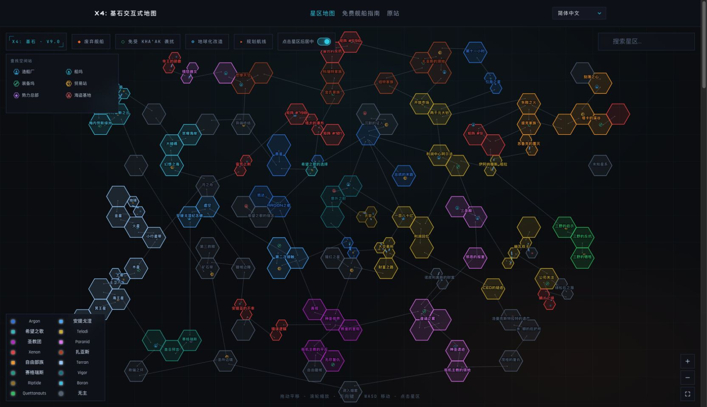

# X4 Foundations Interactive Map

[简体中文](./README.md) | [English](./README.en.md)

> A bilingual interactive universe map and free-ship guide for X4: Foundations v9.0.

[](https://github.com/Ximu-Luya/x4-foundations-interactive-map/actions/workflows/ci.yml)
[](https://crowdin.com/project/x4-foundations-interactive-map)

[Live Demo](https://x4.ximustudio.top/?lang=en-US) · [Translate on Crowdin](https://crowdin.com/project/x4-foundations-interactive-map) · [Source Map](https://veanturverse.com/guides/x4-universe-map.html)

[](https://x4.ximustudio.top/?lang=en-US)

## About this project

This is an unofficial localized and engineered edition of the [Veanturverse X4 interactive map](https://veanturverse.com/guides/x4-universe-map.html) and its free-ship guide. It preserves the source site's data, map relationships, and guide content while rebuilding the original pages as a maintainable Vite + React + TypeScript single-page application. The project adds Chinese localization, responsive support, automated testing, Crowdin collaboration, and a unified deployment workflow.

This project is not affiliated with or endorsed by Egosoft or Veanturverse. Its purpose is to make the original content easier to use for Chinese-speaking players and easier to maintain, verify, and extend as software.

## Features

- 152 sectors and 179 gate or superhighway connections based on the X4 v9.0 universe layout.
- Mouse dragging, wheel zooming, arrow-key and WASD navigation, plus mobile support.
- Chinese and English interfaces, bilingual search, faction filters, and station-type filters.
- Layers for derelict ships, Timelines reward ships, Kha'ak-safe areas, and terraformable sectors.
- Resource and station information, cross-sector route planning, deep links, and local discovery state.
- An integrated illustrated free-ship guide with two-way navigation between ship details and map locations.
- Compatibility with the original `/guides/x4-universe-map.html` path and the `ship`, `tlship`, `sector`, `from`, and `to` parameters.

## Tech stack

- Vite, React, and TypeScript
- i18next and ICU MessageFormat
- Vitest, Testing Library, and Playwright
- Biome and GitHub Actions
- Crowdin CLI and Crowdin GitHub Integration

## Local development

Node.js 20.19 or later is required.

```bash
git clone https://github.com/Ximu-Luya/x4-foundations-interactive-map.git
cd x4-foundations-interactive-map
npm ci
npm run dev
```

The application defaults to Simplified Chinese. Switch to English from the language menu in the top-right corner, or use `?lang=zh-CN` and `?lang=en-US` directly.

## Commands

| Command | Purpose |
| --- | --- |
| `npm run dev` | Start the local development server |
| `npm run build` | Type-check and create the production build |
| `npm test` | Run Vitest unit and component tests |
| `npm run test:e2e` | Build and run desktop and mobile Playwright tests |
| `npm run lint` | Run Biome checks |
| `npm run typecheck` | Run TypeScript type checking |
| `npm run verify` | Run the complete project verification suite |

## Contributing translations through Crowdin

English is the source language. All target-language translation and review happens in the [Crowdin project](https://crowdin.com/project/x4-foundations-interactive-map). The application currently ships with Simplified Chinese and English; contributions to Chinese and proposals for additional languages are welcome.

1. Open the Crowdin project and join as a translator.
2. If your language is already enabled, select it and translate the English source strings. If it is not available yet, [request the language](https://github.com/Ximu-Luya/x4-foundations-interactive-map/issues/new) and include its name, locale code, and the scope you are willing to maintain.
3. Prefer terminology used by the official X4 localization, especially for sectors, factions, ships, and facilities.
4. Preserve ICU variables such as `{count}`, `{sector}`, and `{start}`. Do not rename variables, remove placeholders, or translate JSON keys.
5. Submit translations in Crowdin for review. Final translations should be written and reviewed by people rather than generated with Crowdin AI or machine translation.
6. Once a new language reaches release quality, maintainers will add its application metadata, build configuration, and tests before importing it through a Crowdin localization pull request.

Regular code pull requests maintain the English source and should not directly edit tracked target-language JSON files. See the [localization guide](./docs/localization.md) for the maintainer workflow and ICU rules.

## Documentation

- [Localization workflow](./docs/localization.md)
- [Architecture and implementation boundaries](./docs/architecture.md)

## Attribution and notice

Map data, guide content, and related assets originate from Veanturverse. X4: Foundations and related names and marks belong to their respective owners. This repository currently does not declare an open-source license; verify the applicable permissions before copying, distributing, or republishing its contents.
