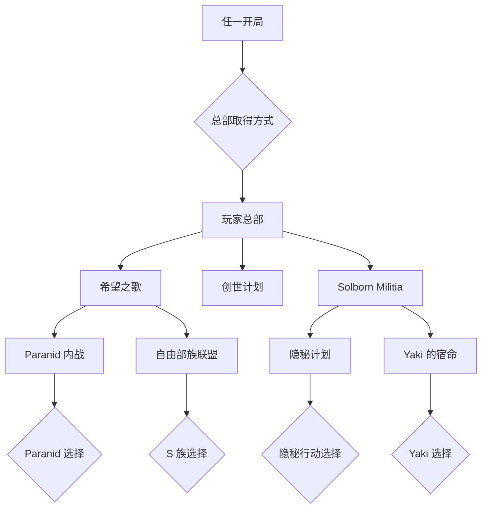

# X4 开局与故事线

这组文档把参考流程图拆成九个独立开局，并在公共任务节点合并。页面版交互图位于 [`/storylines/`](../../src/ui/StorylinesPage.tsx)；点击开局后，图中会高亮该开局可达的任务、选择点和结局。

## 阅读口径

- **开局独享**：只从某个开局进入的开场任务或总部取得方式。
- **公共前置**：多个开局都能进入，但仍需满足图中标记的前置条件。
- **选择点**：同一条任务线后续只能选一个方向；文档列出可见的主要结果。
- **结局**：这里记录剧情造成的主要世界状态变化，不把“任务完成”误写成唯一结局。
- 范围是参考图所覆盖的本体、`Split Vendetta`、`Cradle of Humanity`。未在图中明确的细节保留为待核对项。

## 分开阅读

1. [初生牛犊](./01-young-gun.md)
2. [新兴的创业家](./02-entrepreneur.md)
3. [职业军人](./03-warrior.md)
4. [新手探险家](./04-explorer.md)
5. [颇有成就的科学家](./05-scientist.md)
6. [失败之火](./06-fires-of-defeat.md)
7. [族长之矛](./07-spear-of-the-patriarch.md)
8. [Terran 军官学员](./08-terran-cadet.md)
9. [创世计划](./09-project-genesis.md)

## 合流总览

> 这是结构化梳理，不是对游戏任务触发条件的完整数据库。具体任务名称、触发时机和少数分支仍建议在游戏内逐项复核。
